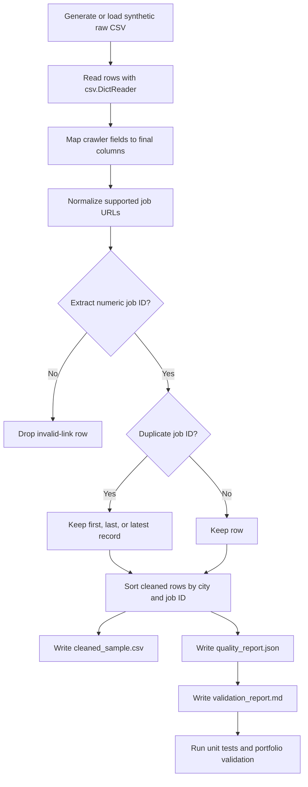

# Recruitment Data Cleaning Agent

Turn messy recruitment CSV exports into a tested, auditable, public-safe cleaning workflow for analysis and research demos.

[English](README.md) / [简体中文](README.zh-CN.md)

## Demo Results

Results below come from the synthetic demonstration dataset in [`sample_data/raw/sample_recruitment_raw.csv`](sample_data/raw/sample_recruitment_raw.csv).

| Metric | Result | Source |
| --- | ---: | --- |
| Input rows | 104 | [`demo_outputs/quality_report.json`](demo_outputs/quality_report.json) |
| Output rows | 99 | [`demo_outputs/quality_report.json`](demo_outputs/quality_report.json) |
| Invalid links dropped | 2 | [`demo_outputs/validation_report.md`](demo_outputs/validation_report.md) |
| Duplicate rows removed | 3 | [`demo_outputs/quality_report.md`](demo_outputs/quality_report.md) |
| Unique job IDs | 99 | [`demo_outputs/quality_report.json`](demo_outputs/quality_report.json) |
| Non-empty city rows | 99 | [`demo_outputs/validation_report.md`](demo_outputs/validation_report.md) |
| Non-empty salary rows | 99 | [`demo_outputs/validation_report.md`](demo_outputs/validation_report.md) |
| Unit tests | 4 passed | [`demo_outputs/test_results.txt`](demo_outputs/test_results.txt) |
| Portfolio validation | PASS, 19 files scanned, 0 sensitive findings | [`portfolio_validation_report.md`](portfolio_validation_report.md) |

## Why This Project Matters

Recruitment datasets used for data analysis, business analysis, and industry research often start as crawler exports with inconsistent field names, tracking links, duplicated postings, and weak audit trails. This project shows how I would turn that kind of raw CSV handoff into a repeatable workflow: normalize the schema, preserve useful business fields, remove records that cannot be validated, produce reviewable reports, and check that the public package does not leak private material.

The repository is a portfolio-safe version. It uses synthetic data only and keeps the implementation small enough for reviewers to inspect quickly.

## Key Capabilities

- Generates a synthetic recruitment CSV sample with 104 rows for repeatable demos.
- Maps crawler fields into analysis-ready columns: `sal`, `er`, `er1`, `er2`, and `字段1`.
- Normalizes supported job detail URLs and strips tracking query strings.
- Extracts numeric job IDs from valid job links.
- Drops invalid job links before export.
- Deduplicates by job ID, keeping the latest record by `采集时的时间` by default.
- Writes a cleaned CSV, JSON quality report, and Markdown validation report.
- Runs unit tests for URL normalization, job ID extraction, field mapping, invalid-link handling, duplicate handling, and final column order.
- Scans the portfolio package for required files, large forbidden artifacts, concrete personal paths, and secret-like assignments.

## Mermaid Workflow



## Quick Start

The commands below are derived from the script arguments in [`scripts/generate_sample_data.py`](scripts/generate_sample_data.py), [`scripts/clean_recruitment_data.py`](scripts/clean_recruitment_data.py), and [`scripts/validate_portfolio.py`](scripts/validate_portfolio.py). They write reproducible outputs to `output/quickstart_demo/`, which is ignored by Git, so the committed demo files are not modified.

```bash
mkdir -p output/quickstart_demo/raw output/quickstart_demo/outputs

python3 scripts/generate_sample_data.py \
  --output output/quickstart_demo/raw/sample_recruitment_raw.csv \
  --rows 104

python3 scripts/clean_recruitment_data.py \
  --input output/quickstart_demo/raw/sample_recruitment_raw.csv \
  --output output/quickstart_demo/outputs/cleaned_sample.csv \
  --quality-report output/quickstart_demo/outputs/quality_report.json \
  --validation-report output/quickstart_demo/outputs/validation_report.md \
  --dedup-keep latest \
  --overwrite

python3 -m unittest discover -s tests

python3 scripts/validate_portfolio.py \
  --root . \
  --output output/quickstart_demo/outputs/portfolio_validation_report.md
```

## Demonstration Outputs

- Cleaned sample CSV: [`demo_outputs/cleaned_sample.csv`](demo_outputs/cleaned_sample.csv)
- JSON quality report: [`demo_outputs/quality_report.json`](demo_outputs/quality_report.json)
- Markdown quality summary: [`demo_outputs/quality_report.md`](demo_outputs/quality_report.md)
- Validation report for the cleaned sample: [`demo_outputs/validation_report.md`](demo_outputs/validation_report.md)
- Unit test output: [`demo_outputs/test_results.txt`](demo_outputs/test_results.txt)
- Portfolio package validation: [`portfolio_validation_report.md`](portfolio_validation_report.md)

## Repository Structure

```text
.agents/skills/recruitment-data-cleaning/SKILL.md  Agent workflow and cleaning rules
agents/openai.yaml                                  Agent entrypoints and safety notes
scripts/generate_sample_data.py                     Synthetic data generator
scripts/clean_recruitment_data.py                   CSV cleaner and report writer
scripts/validate_portfolio.py                       Public-safety validator
tests/test_clean_recruitment_data.py                Unit tests
sample_data/raw/sample_recruitment_raw.csv          Synthetic raw demo input
demo_outputs/                                       Committed demo outputs
portfolio_validation_report.md                      Repository safety validation
PUBLIC_FILE_MANIFEST.md                             Public file list
requirements.txt                                    Dependency note
```

## Testing and Validation

The current demo artifacts show:

- `python3 -m unittest discover -s tests`: 4 tests passed.
- `python3 scripts/validate_portfolio.py --root . --output portfolio_validation_report.md`: PASS.
- Portfolio validation scanned 19 files and found 0 sensitive findings, 0 missing required files, and 0 large/forbidden files.

## Data Privacy and Public-Safe Design

This repository is designed for public review. The demo input is synthetic data, generated by [`scripts/generate_sample_data.py`](scripts/generate_sample_data.py). The validator checks for concrete personal paths, secret-like assignments, missing required files, and large forbidden artifacts. The committed package intentionally excludes real recruitment exports, private notebooks, cookies, tokens, account credentials, historical aggregates, and local machine paths.

## Limitations

- The cleaner handles CSV input and the public demo URL patterns defined in the code.
- It does not fetch live job pages or enrich data from external sources.
- It does not infer city from company names, file names, or private task metadata.
- The sample dataset is synthetic and should be used to evaluate workflow design, not labor-market conditions.
- The project uses Python standard-library CSV handling rather than a full data-processing framework.

## Maintainer

Wanting Zhang  
GitHub: https://github.com/ysqswvfmsv-hue
