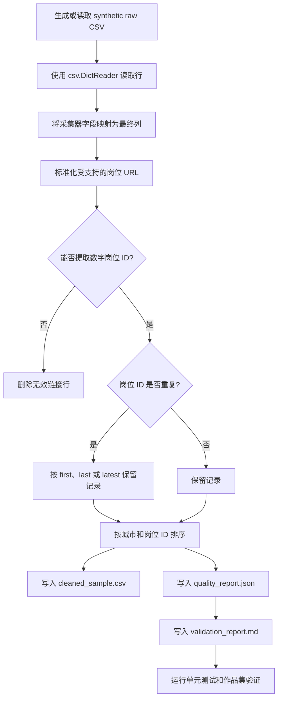

# 招聘数据清洗 Agent

[](https://github.com/ysqswvfmsv-hue/recruitment-data-cleaning-agent/actions/workflows/portfolio-validation.yml)

将杂乱的招聘 CSV 导出整理成可测试、可审计、适合公开展示的数据清洗工作流。

[English](README.md) / [简体中文](README.zh-CN.md)

## Demo Results

以下结果来自 [`sample_data/raw/sample_recruitment_raw.csv`](sample_data/raw/sample_recruitment_raw.csv) 中的 synthetic demonstration dataset。

| 指标 | 结果 | 来源 |
| --- | ---: | --- |
| 输入行数 | 104 | [`demo_outputs/quality_report.json`](demo_outputs/quality_report.json) |
| 输出行数 | 99 | [`demo_outputs/quality_report.json`](demo_outputs/quality_report.json) |
| 删除无效链接 | 2 | [`demo_outputs/validation_report.md`](demo_outputs/validation_report.md) |
| 删除重复记录 | 3 | [`demo_outputs/quality_report.md`](demo_outputs/quality_report.md) |
| 唯一岗位 ID | 99 | [`demo_outputs/quality_report.json`](demo_outputs/quality_report.json) |
| 城市非空行数 | 99 | [`demo_outputs/validation_report.md`](demo_outputs/validation_report.md) |
| 薪资非空行数 | 99 | [`demo_outputs/validation_report.md`](demo_outputs/validation_report.md) |
| 单元测试 | 4 passed | [`demo_outputs/test_results.txt`](demo_outputs/test_results.txt) |
| 作品集发布验证 | PASS，扫描 19 个文件，0 个敏感信息发现 | [`portfolio_validation_report.md`](portfolio_validation_report.md) |

## Why This Project Matters

招聘数据分析、商业分析和行业研究常常从采集工具导出的 CSV 开始。这类数据容易出现字段名不统一、链接携带追踪参数、岗位重复、质量说明不足等问题。本项目展示了我如何把这类原始 CSV 交接转化为可复现的工作流：统一字段、保留可分析业务字段、删除无法验证的记录、生成可审计报告，并检查公开版本是否包含敏感材料。

这是一个适合公开展示的作品集版本。仓库只使用 synthetic data，代码规模也刻意保持简洁，方便招聘者快速阅读。

## Key Capabilities

- 生成 104 行 synthetic 招聘 CSV 样例，用于可复现演示。
- 将采集器字段映射为分析字段：`sal`、`er`、`er1`、`er2`、`字段1`。
- 标准化受支持的岗位详情链接，并去除追踪查询参数。
- 从有效岗位链接中提取数字岗位 ID。
- 导出前删除无效岗位链接。
- 按岗位 ID 去重，默认根据 `采集时的时间` 保留最新记录。
- 输出清洗后 CSV、JSON 质量报告和 Markdown 验证报告。
- 使用单元测试覆盖 URL 标准化、岗位 ID 提取、字段映射、无效链接处理、重复处理和最终列顺序。
- 检查作品集包是否缺少必要文件、包含大型禁止文件、具体个人路径或类似密钥赋值的内容。

## Mermaid Workflow



## Quick Start

以下命令根据 [`scripts/generate_sample_data.py`](scripts/generate_sample_data.py)、[`scripts/clean_recruitment_data.py`](scripts/clean_recruitment_data.py) 和 [`scripts/validate_portfolio.py`](scripts/validate_portfolio.py) 的真实参数编写。命令会把复现实验输出写入已被 Git 忽略的 `output/quickstart_demo/`，因此不会修改仓库中已提交的 demo 文件。

```bash
mkdir -p output/quickstart_demo/raw output/quickstart_demo/outputs

python3 scripts/generate_sample_data.py \
  --output output/quickstart_demo/raw/sample_recruitment_raw.csv \
  --rows 104

python3 scripts/clean_recruitment_data.py \
  --input output/quickstart_demo/raw/sample_recruitment_raw.csv \
  --output output/quickstart_demo/outputs/cleaned_sample.csv \
  --quality-report output/quickstart_demo/outputs/quality_report.json \
  --validation-report output/quickstart_demo/outputs/validation_report.md \
  --dedup-keep latest \
  --overwrite

python3 -m unittest discover -s tests

python3 scripts/validate_portfolio.py \
  --root . \
  --output output/quickstart_demo/outputs/portfolio_validation_report.md
```

## Demonstration Outputs

- 清洗后样例 CSV：[`demo_outputs/cleaned_sample.csv`](demo_outputs/cleaned_sample.csv)
- JSON 质量报告：[`demo_outputs/quality_report.json`](demo_outputs/quality_report.json)
- Markdown 质量摘要：[`demo_outputs/quality_report.md`](demo_outputs/quality_report.md)
- 清洗样例验证报告：[`demo_outputs/validation_report.md`](demo_outputs/validation_report.md)
- 单元测试输出：[`demo_outputs/test_results.txt`](demo_outputs/test_results.txt)
- 作品集包发布验证：[`portfolio_validation_report.md`](portfolio_validation_report.md)

## Repository Structure

```text
.agents/skills/recruitment-data-cleaning/SKILL.md  Agent 工作流和清洗规则
agents/openai.yaml                                  Agent 入口和安全说明
scripts/generate_sample_data.py                     synthetic 数据生成脚本
scripts/clean_recruitment_data.py                   CSV 清洗和报告生成脚本
scripts/validate_portfolio.py                       公开安全验证脚本
tests/test_clean_recruitment_data.py                单元测试
sample_data/raw/sample_recruitment_raw.csv          synthetic raw demo 输入
demo_outputs/                                       已提交的 demo 输出
portfolio_validation_report.md                      仓库安全验证
PUBLIC_FILE_MANIFEST.md                             公开文件清单
requirements.txt                                    依赖说明
```

## Testing and Validation

当前 demo artifacts 显示：

- `python3 -m unittest discover -s tests`：4 tests passed。
- `python3 scripts/validate_portfolio.py --root . --output portfolio_validation_report.md`：PASS。
- 作品集验证扫描 19 个文件，发现 0 个敏感信息、0 个缺失必要文件、0 个大型或禁止文件。

## Data Privacy and Public-Safe Design

本仓库面向公开审阅设计。demo 输入由 [`scripts/generate_sample_data.py`](scripts/generate_sample_data.py) 生成，属于 synthetic data。验证脚本会检查具体个人路径、类似密钥赋值的内容、必要文件缺失和大型禁止文件。当前提交包不包含真实招聘导出、私有 Notebook、Cookie、Token、账号凭据、历史汇总数据或本机路径。

## Limitations

- 清洗器处理 CSV 输入和代码中定义的公开 demo URL 规则。
- 不抓取实时岗位详情页，也不从外部来源补充数据。
- 不从公司名称、文件名或私有任务元数据推断城市。
- 样例数据是 synthetic data，适合评估工作流设计，不适合分析真实劳动力市场。
- 项目使用 Python 标准库 CSV 处理，而不是完整的数据处理框架。

## Maintainer

Wanting Zhang  
GitHub: https://github.com/ysqswvfmsv-hue
